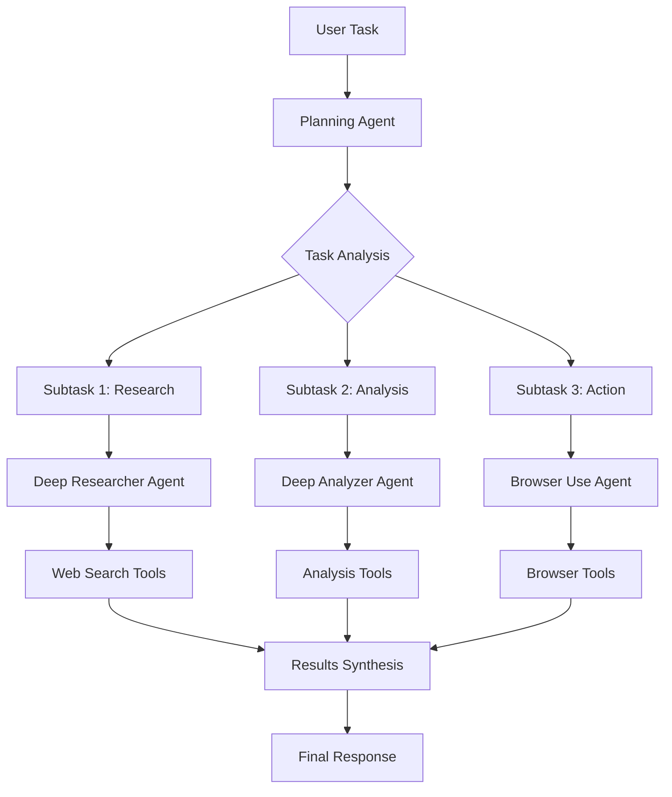

# Architecture Overview

DeepResearchAgent is a hierarchical multi-agent framework designed for general-purpose task solving and deep research capabilities.

## Core Architecture

### Hierarchical Structure

```
Planning Agent (Conductor)
├── Deep Analyzer Agent
├── Deep Researcher Agent
├── Browser Use Agent
└── MCP Manager Agent
```

The system uses a **conductor-orchestra metaphor** where:
- **Planning Agent**: Acts as the conductor, coordinating workflow and task decomposition
- **Specialized Agents**: Act as orchestra members, each with specific capabilities
- **Asynchronous Framework**: Enables efficient parallel task execution

### Agent Types

#### Planning Agent
- **Role**: Central coordinator and task decomposer
- **Capabilities**:
  - Breaks down complex tasks into manageable subtasks
  - Coordinates workflow between specialized agents
  - Manages inter-agent communication
  - Provides execution summaries
- **Models**: Primarily uses Claude-3.7-Sonnet-Thinking for strategic planning

#### Deep Analyzer Agent
- **Role**: Systematic analysis and reasoning
- **Capabilities**:
  - Performs step-by-step analysis
  - Handles complex logical reasoning
  - Processes structured data analysis
  - Generates detailed insights
- **Models**: Configurable, defaults to Claude models for reasoning

#### Deep Researcher Agent
- **Role**: Comprehensive web research and information gathering
- **Capabilities**:
  - Conducts extensive web searches
  - Follows research leads across multiple sources
  - Synthesizes information from various sources
  - Generates research summaries
- **Models**: Typically uses GPT-4.1 for research tasks

#### Browser Use Agent
- **Role**: Web automation and interaction
- **Capabilities**:
  - Automated web browsing
  - Form filling and navigation
  - Screenshot capture and analysis
  - Interactive web tasks
- **Models**: Optimized for visual understanding and web interaction

#### MCP Manager Agent
- **Role**: Dynamic tool discovery and execution
- **Capabilities**:
  - Model Context Protocol integration
  - Local and remote tool loading
  - Tool evolution and reuse
  - Custom tool creation

## Technical Architecture

### Component Structure

```
src/
├── agent/           # Agent implementations
│   ├── planning_agent/
│   ├── deep_analyzer_agent/
│   ├── deep_researcher_agent/
│   ├── browser_use_agent/
│   └── base/        # Base classes and interfaces
├── tools/           # Tool implementations
│   ├── web_searcher_tool
│   ├── python_interpreter_tool
│   ├── browser_use_tool
│   └── deep_analyzer_tool
├── models/          # LLM model adapters
│   ├── openaillm.py
│   ├── litellm.py
│   └── api_validator.py
├── mcp/             # Model Context Protocol
├── compat/          # Compatibility management
└── config/          # Configuration system
```

### Key Design Patterns

#### Registry Pattern
- **Models**: Registered in `ModelManager` for dynamic loading
- **Tools**: Registered in `TOOL` registry for flexible tool assignment
- **Agents**: Factory pattern for agent creation

#### Async/Await Pattern
- All agent operations use asyncio for concurrency
- Enables parallel task execution
- Non-blocking I/O for web requests and model calls

#### Configuration-Driven Design
- MMEngine-based configuration system
- Environment-specific configurations
- Runtime configuration overrides

#### Tool-Based Architecture
- Standardized tool interfaces
- Pluggable tool system
- Tool chaining and composition

## Data Flow

### Task Execution Flow



### Communication Patterns

#### Agent-to-Agent Communication
- Structured message passing
- Result aggregation
- Status reporting
- Error propagation

#### Model Integration
- Provider abstraction layer
- Failover mechanisms
- Load balancing
- Rate limiting

#### Tool Orchestration
- Dynamic tool selection
- Parameter mapping
- Result transformation
- Error handling

## Scalability Features

### Parallel Execution
- Concurrent agent operations
- Asynchronous tool calls
- Batch processing capabilities
- Resource pooling

### Resource Management
- Connection pooling for HTTP clients
- Model instance management
- Memory optimization
- Cleanup mechanisms

### Error Handling
- Graceful degradation
- Retry mechanisms
- Circuit breaker patterns
- Comprehensive logging

## Security Architecture

### Sandboxed Execution
- Restricted Python execution environment
- Configurable import controls
- Resource limits
- Secure tool interfaces

### API Security
- Environment-based configuration
- Key rotation support
- Rate limiting
- Request validation

### Browser Security
- Isolated browser instances
- Automatic cleanup
- Security policy enforcement
- Content filtering

## Integration Points

### External Services
- **OpenAI API**: GPT models for various tasks
- **Anthropic API**: Claude models for reasoning
- **Google AI**: Gemini models for multimodal tasks
- **Firecrawl**: Web scraping and content extraction
- **Local Models**: vLLM and HuggingFace integration

### Development Tools
- **Playwright**: Browser automation
- **pytest**: Testing framework
- **UV**: Dependency management
- **MMEngine**: Configuration system

### Monitoring and Observability
- Structured logging with loguru
- Performance metrics
- Error tracking
- Resource monitoring

## Performance Characteristics

### Benchmarks
- **GAIA Benchmark**: 83.39% average performance
  - Level 1: 93.55%
  - Level 2: 83.02%
  - Level 3: 65.31%

### Optimization Features
- **Hierarchical Coordination**: Reduces redundant computations
- **Tool Caching**: Improves response times for repeated operations
- **Asynchronous Execution**: Enables parallel agent operations
- **Smart Routing**: Optimal model selection for tasks

## Extensibility

### Adding New Agents
1. Inherit from base agent classes
2. Implement required methods
3. Register in agent factory
4. Configure in project settings

### Custom Tools
1. Follow base tool interface
2. Implement async execution
3. Add error handling
4. Register in tool registry

### Model Providers
1. Implement provider interface
2. Add configuration support
3. Handle authentication
4. Register in model manager

## Future Architecture

The system is designed for evolution toward:
- **SVG-Enhanced TUI**: Visual interface with LLM understanding
- **Multi-Modal Agents**: Vision, audio, and video capabilities
- **Distributed Execution**: Multi-node deployment
- **Advanced Reasoning**: Chain-of-thought and tree-of-thought patterns

For implementation details, see:
- [Agent Development Guide](../development/AGENT_DEVELOPMENT.md)
- [Tool Development Guide](../development/TOOL_DEVELOPMENT.md)
- [Model Integration Guide](../models/INTEGRATION.md)
- [Security Guidelines](../security/GUIDELINES.md)