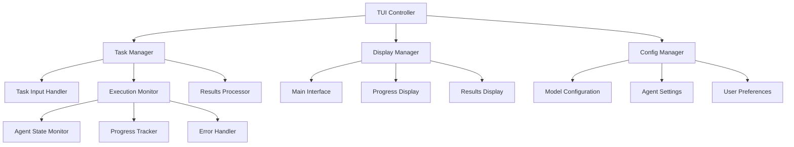

# TUI Implementation Analysis and Strategy

> **Status**: Planning Phase - No Implementation Yet
> **Date**: 2025-01-16
> **Purpose**: Comprehensive analysis of current system issues and TUI implementation strategy

## 🔍 Current System Analysis

### Log Analysis Results

From examination of `workdir/cli_fallback/log.txt`, several critical issues identified:

#### 1. **User Experience Problems**

**Issue: Hardcoded Demo Task**
```python
# main.py:72
task = "Use deep_researcher_agent to search the latest papers on the topic of 'AI Agent' and then summarize it."
```
- **Impact**: No way for end users to input custom research tasks
- **Severity**: Critical - Makes application unusable for real user needs
- **Evidence**: Every execution runs same hardcoded research demo

**Issue: No Interactive Input Mechanism**
- **Impact**: Application runs → executes → exits with no user interaction
- **Severity**: Critical - No way to control or customize execution
- **Evidence**: No prompts, no input collection, no user choice points

**Issue: Results Only in Log Files**
- **Impact**: Users must manually check `workdir/cli_fallback/log.txt` for results
- **Severity**: High - Poor user experience for accessing results
- **Evidence**: No terminal output of results, only debug logging

#### 2. **Technical Problems**

**Issue: Authentication Failures**
```
401 Client Error: Unauthorized for url: https://api.featherless.ai/v1/chat/completions
```
- **Impact**: HuggingFace routing through Featherless AI failing authentication
- **Severity**: High - Causes task execution failures
- **Root Cause**: HuggingFace Inference API routing configuration

**Issue: Tool Call Parsing Errors** (from previous sessions)
```
Error while parsing tool call from model output: 'function'
```
- **Impact**: Agent tool execution failures
- **Severity**: Medium - System continues but with degraded functionality
- **Partial Fix**: Temperature lowered to 0.1, timeout increased to 300s

#### 3. **Positive Findings**

**✅ CLI-First System Working**
- Model aliases functioning perfectly: `claude-3.7-sonnet-thinking` → `qwen2.5-32b-instruct`
- 23 models registered successfully
- API validation working correctly

**✅ Hierarchical Agent Architecture**
- Planning agent with 3 managed sub-agents initialized correctly
- Agent tree visualization working
- MCP integration functioning

**✅ Logging and Error Handling**
- Comprehensive logging to dedicated `workdir/cli_fallback/` folder
- Proper error tracing and debugging information
- Configuration validation working

## 🎯 TUI Requirements Analysis

### User Journey Mapping

**Current State (Broken)**:
```
User → Run Command → Watch Logs → Check Log Files → End
```

**Desired State**:
```
User → Launch TUI → Input Task → Monitor Progress → View Results → Continue/Exit
```

### Critical User Needs Identified

1. **Task Input & Management**
   - Custom task input with validation
   - Task history and reuse
   - Task templates/suggestions
   - Multi-step task building

2. **Real-time Progress Monitoring**
   - Agent execution status
   - Step-by-step progress visibility
   - Error handling and recovery options
   - Cancellation/pause capabilities

3. **Results Management**
   - Formatted result display
   - Export options (markdown, JSON, etc.)
   - Result comparison and analysis
   - Search through historical results

4. **System Management**
   - Model status and switching
   - Configuration management
   - Log access and filtering
   - Performance monitoring

## 🖼️ TUI Interface Design

### Main Interface Layout

```
╭─────────────────────────────────────────────────────────────────────────╮
│                    🤖 DeepResearchAgent v2.0                            │
├─────────────────────────────────────────────────────────────────────────┤
│  Status: ✅ Ready    Models: 23 Active    Config: CLI-First            │
├─────────────────────────────────────────────────────────────────────────┤
│                                                                         │
│  ┌─ Quick Actions ─────────────────┐  ┌─ Recent Tasks ─────────────────┐ │
│  │                                 │  │                                │ │
│  │  🔬 New Research Task          │  │  📚 Search AI safety papers    │ │
│  │  📊 Analysis Task              │  │  🌐 Web scraping analysis      │ │
│  │  🌐 Web Research               │  │  📈 Market trend research      │ │
│  │  📝 Custom Agent Workflow      │  │  💡 Tech comparison study      │ │
│  │                                 │  │                                │ │
│  └─────────────────────────────────┘  └────────────────────────────────┘ │
│                                                                         │
│  ┌─ System Status ─────────────────────────────────────────────────────┐ │
│  │                                                                     │ │
│  │  🧠 Planning Agent: claude-3.7-sonnet → qwen2.5-32b (Active)      │ │
│  │  🔍 Deep Researcher: qwen2.5-32b-instruct (Ready)                  │ │
│  │  📊 Deep Analyzer: qwen2.5-32b-instruct (Ready)                    │ │
│  │  🌐 Browser Agent: qwen2.5-32b-instruct (Ready)                    │ │
│  │                                                                     │ │
│  └─────────────────────────────────────────────────────────────────────┘ │
│                                                                         │
├─────────────────────────────────────────────────────────────────────────┤
│  [N]ew Task  [H]istory  [S]ettings  [L]ogs  [Q]uit                     │
╰─────────────────────────────────────────────────────────────────────────╯
```

### Task Input Interface

```
╭─────────────────────────────────────────────────────────────────────────╮
│                        📝 New Research Task                             │
├─────────────────────────────────────────────────────────────────────────┤
│                                                                         │
│  Task Description:                                                      │
│  ┌─────────────────────────────────────────────────────────────────────┐ │
│  │ Research the latest developments in quantum computing applications  │ │
│  │ for machine learning, focusing on papers from 2024-2025           │ │
│  │                                                                     │ │
│  │                                                                     │ │
│  └─────────────────────────────────────────────────────────────────────┘ │
│                                                                         │
│  ┌─ Task Template ─────────┐  ┌─ Agent Selection ─────────────────────┐  │
│  │                         │  │                                       │  │
│  │  📚 Research Paper      │  │  ☑️ Planning Agent (Required)         │  │
│  │  🌐 Web Analysis        │  │  ☑️ Deep Researcher                   │  │
│  │  📊 Data Analysis       │  │  ☐ Deep Analyzer                     │  │
│  │  💻 Code Analysis       │  │  ☐ Browser Agent                     │  │
│  │  🎯 Custom Workflow     │  │                                       │  │
│  │                         │  │  Max Steps: [20] ▼                   │  │
│  └─────────────────────────┘  └───────────────────────────────────────┘  │
│                                                                         │
│  ┌─ Output Preferences ────────────────────────────────────────────────┐  │
│  │  Format: [📄 Markdown] ▼   Detail: [🔍 Comprehensive] ▼            │  │
│  │  Save: ☑️ Results  ☑️ Logs  ☑️ Export to File                      │  │
│  └─────────────────────────────────────────────────────────────────────┘  │
│                                                                         │
├─────────────────────────────────────────────────────────────────────────┤
│  [Tab] Next Field  [Enter] Start Task  [Esc] Cancel                    │
╰─────────────────────────────────────────────────────────────────────────╯
```

### Task Execution Interface

```
╭─────────────────────────────────────────────────────────────────────────╮
│           🔄 Executing: Quantum Computing ML Research                   │
├─────────────────────────────────────────────────────────────────────────┤
│                                                                         │
│  ┌─ Progress Overview ─────────────────────────────────────────────────┐  │
│  │                                                                     │  │
│  │  Phase 1: Planning        ████████████████████████ 100% ✅          │  │
│  │  Phase 2: Research        ██████████████▒▒▒▒▒▒▒▒▒  65% 🔄          │  │
│  │  Phase 3: Analysis        ▒▒▒▒▒▒▒▒▒▒▒▒▒▒▒▒▒▒▒▒▒▒▒   0% ⏳           │  │
│  │  Phase 4: Summary         ▒▒▒▒▒▒▒▒▒▒▒▒▒▒▒▒▒▒▒▒▒▒▒   0% ⏳           │  │
│  │                                                                     │  │
│  │  Elapsed: 2m 34s    Estimated: 5m 12s remaining                    │  │
│  └─────────────────────────────────────────────────────────────────────┘  │
│                                                                         │
│  ┌─ Current Activity ──────────────────────────────────────────────────┐  │
│  │                                                                     │  │
│  │  🔍 Deep Researcher Agent                                           │  │
│  │  └─ Searching arXiv for quantum ML papers (2024-2025)              │  │
│  │     └─ Found 23 relevant papers, analyzing abstracts...             │  │
│  │                                                                     │  │
│  │  📊 Step 2/3: Processing search results                             │  │
│  │  ⏱️  Duration: 0m 45s                                               │  │
│  │                                                                     │  │
│  └─────────────────────────────────────────────────────────────────────┘  │
│                                                                         │
│  ┌─ Live Results ──────────────────────────────────────────────────────┐  │
│  │                                                                     │  │
│  │  📄 Found Papers:                                                   │  │
│  │  • "Quantum-Classical Hybrid ML for..." (Nature, 2024)             │  │
│  │  • "Variational Quantum Algorithms in..." (Science, 2024)          │  │
│  │  • "Quantum Feature Maps for Deep..." (arXiv, 2025)                │  │
│  │                                                                     │  │
│  │  [↓ Scroll] [More results loading...]                              │  │
│  └─────────────────────────────────────────────────────────────────────┘  │
│                                                                         │
├─────────────────────────────────────────────────────────────────────────┤
│  [Space] Pause  [Ctrl+C] Stop  [L] View Logs  [F] Full Screen Results │
╰─────────────────────────────────────────────────────────────────────────╯
```

### Results Display Interface

```
╭─────────────────────────────────────────────────────────────────────────╮
│               📊 Task Results: Quantum Computing ML Research            │
├─────────────────────────────────────────────────────────────────────────┤
│                                                                         │
│  ┌─ Executive Summary ─────────────────────────────────────────────────┐  │
│  │                                                                     │  │
│  │  ✅ Task completed successfully in 4m 52s                          │  │
│  │  📚 Analyzed 23 papers from arXiv, Nature, Science (2024-2025)     │  │
│  │  🎯 Key findings: 3 major breakthrough areas identified             │  │
│  │  📈 Trend: 40% increase in hybrid quantum-classical approaches     │  │
│  │                                                                     │  │
│  └─────────────────────────────────────────────────────────────────────┘  │
│                                                                         │
│  ┌─ Detailed Results ──────────────────────────────────────────────────┐  │
│  │                                                                     │  │
│  │  ## Key Findings                                                   │▲│
│  │                                                                     │││
│  │  ### 1. Quantum Feature Maps Revolution                            │││
│  │  Recent papers show significant advances in quantum feature        │││
│  │  mapping for classical ML integration...                           │││
│  │                                                                     │││
│  │  ### 2. Variational Quantum Algorithms                            │││
│  │  New VQA approaches demonstrate 3x speedup over classical          │││
│  │  methods for specific optimization problems...                     │││
│  │                                                                     │││
│  │  ### 3. Hardware Implementation Progress                           │││
│  │  IBM and Google report successful deployment of quantum ML         │││
│  │  algorithms on 100+ qubit systems...                              │▼│
│  │                                                                     │││
│  └─────────────────────────────────────────────────────────────────────┘  │
│                                                                         │
│  ┌─ Actions ───────────────────────────────────────────────────────────┐  │
│  │  [📄] Export MD  [📋] Copy Text  [🔗] Share Link  [💾] Save to File   │  │
│  │  [🔍] Deep Analysis  [📈] Generate Charts  [🌐] Web Summary         │  │
│  └─────────────────────────────────────────────────────────────────────┘  │
│                                                                         │
├─────────────────────────────────────────────────────────────────────────┤
│  [N]ew Task  [H]istory  [E]dit & Rerun  [S]hare  [Q]uit                │
╰─────────────────────────────────────────────────────────────────────────╯
```

## 🗺️ Implementation Strategy

### Phase-Based Development Approach

#### Phase 1: Core Foundation (Week 1-2)
**Goal**: Basic interactive TUI with task input and execution

**Key Components**:
- Interactive task input system
- Replace hardcoded task in main.py
- Basic progress display during execution
- Simple results display

**Success Criteria**:
- Users can input custom tasks
- Tasks execute with visual progress
- Results displayed in terminal (not just logs)

#### Phase 2: Enhanced User Experience (Week 3-4)
**Goal**: Rich TUI with real-time monitoring and better visuals

**Key Components**:
- Multi-pane TUI interface using Rich/Textual
- Real-time progress tracking with agent status
- Task history and management
- System status monitoring

**Success Criteria**:
- Professional TUI interface
- Real-time agent execution monitoring
- Task management capabilities

#### Phase 3: Advanced Features (Week 5-6)
**Goal**: Power user features and customization

**Key Components**:
- Task templates and wizards
- Advanced agent configuration
- Results export and sharing
- Performance analytics

**Success Criteria**:
- Template-based task creation
- Advanced configuration options
- Export capabilities

#### Phase 4: SVG Visual Integration (Week 7-8)
**Goal**: Visual agent state representation using SVG

**Key Components**:
- SVG agent state diagrams
- Visual workflow representation
- Interactive agent tree
- LLM-readable visual feedback

**Success Criteria**:
- SVG-based agent visualization
- LLM can interpret visual state
- Interactive agent management

## 🔧 Technical Implementation Plan

### Framework Selection Research

**Candidate TUI Frameworks**:

1. **Rich + Live Display**
   - ✅ Excellent for progress bars and real-time updates
   - ✅ Great terminal graphics and colors
   - ❌ Limited interactivity (no forms, complex input)

2. **Textual (Rich-based)**
   - ✅ Full-featured TUI framework
   - ✅ Widget-based UI with forms, buttons, etc.
   - ✅ CSS-like styling
   - ✅ Reactive programming model

3. **Prompt Toolkit**
   - ✅ Excellent for input handling and forms
   - ✅ Good integration with existing CLI tools
   - ❌ More complex for real-time displays

**Recommendation**: **Textual** for comprehensive TUI, **Rich** for components

### Architecture Patterns



### SVG Integration Strategy

**SVG Agent State Visualization**:
```svg
<!-- Agent execution state diagram -->
<svg viewBox="0 0 800 400">
  <!-- Planning Agent -->
  <rect x="50" y="50" width="150" height="80" fill="#4CAF50" stroke="#2E7D32"/>
  <text x="125" y="90" text-anchor="middle">Planning Agent</text>
  <text x="125" y="110" text-anchor="middle">●●●○ Step 3/4</text>

  <!-- Sub-agents -->
  <rect x="300" y="20" width="120" height="60" fill="#2196F3" stroke="#1565C0"/>
  <text x="360" y="55" text-anchor="middle">Researcher</text>
  <text x="360" y="70" text-anchor="middle">✅ Complete</text>

  <rect x="300" y="100" width="120" height="60" fill="#FF9800" stroke="#E65100"/>
  <text x="360" y="135" text-anchor="middle">Analyzer</text>
  <text x="360" y="150" text-anchor="middle">🔄 Active</text>

  <rect x="300" y="180" width="120" height="60" fill="#9E9E9E" stroke="#424242"/>
  <text x="360" y="215" text-anchor="middle">Browser</text>
  <text x="360" y="230" text-anchor="middle">⏳ Waiting</text>

  <!-- Connection arrows -->
  <path d="M200 90 L300 50" stroke="#666" stroke-width="2" marker-end="url(#arrowhead)"/>
  <path d="M200 90 L300 130" stroke="#666" stroke-width="2" marker-end="url(#arrowhead)"/>
  <path d="M200 90 L300 210" stroke="#666" stroke-width="2" marker-end="url(#arrowhead)"/>
</svg>
```

## ✅ Implementation Todo Breakdown

### Phase 1 Todo Items:
- [ ] Create `src/tui/` package structure
- [ ] Design task input collection system
- [ ] Modify `main.py` to accept task parameter instead of hardcode
- [ ] Create basic progress display using Rich Progress
- [ ] Implement simple results formatting and display
- [ ] Test basic user workflow: input → execute → view results
- [ ] Handle keyboard interrupts gracefully
- [ ] Add basic error messaging for users

### Phase 2 Todo Items:
- [ ] Set up Textual application framework
- [ ] Design main TUI layout with multiple panes
- [ ] Implement real-time agent execution monitoring
- [ ] Create task history storage and display
- [ ] Add system status monitoring dashboard
- [ ] Implement keyboard shortcuts and navigation
- [ ] Add configuration management UI
- [ ] Test all TUI interactions and responsiveness

### Phase 3 Todo Items:
- [ ] Design task template system
- [ ] Implement agent configuration UI
- [ ] Create results export functionality (MD, JSON, HTML)
- [ ] Add performance metrics and analytics
- [ ] Implement search functionality for task history
- [ ] Create user preference system
- [ ] Add help system and tutorials
- [ ] Test advanced features with power users

### Phase 4 Todo Items:
- [ ] Research SVG integration with Textual/Rich
- [ ] Design agent state SVG templates
- [ ] Implement real-time SVG updates
- [ ] Create interactive SVG components
- [ ] Test LLM interpretation of SVG states
- [ ] Implement visual agent tree navigation
- [ ] Create SVG export functionality
- [ ] Document SVG integration patterns

## 📋 Next Immediate Actions

1. **Complete Fault Analysis** ✅ (This document)
2. **Research TUI Framework Details** (Next: Textual deep dive)
3. **Create Detailed Interface Mockups** (ASCII art refinement)
4. **Define Phase 1 Technical Specifications**
5. **Set up Development Branch for TUI work**
6. **Begin Phase 1 Implementation Planning**

---

**Note**: This is a planning document. No implementation should begin until all phases are fully defined and approved.