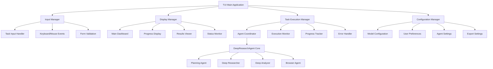
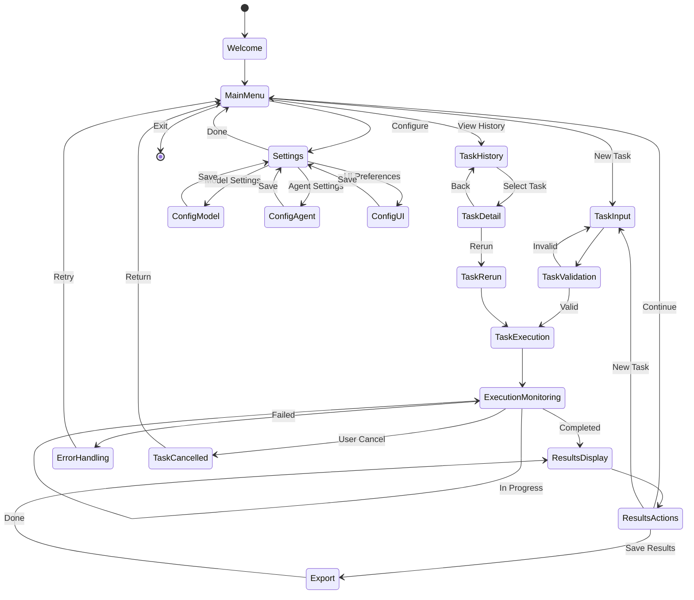
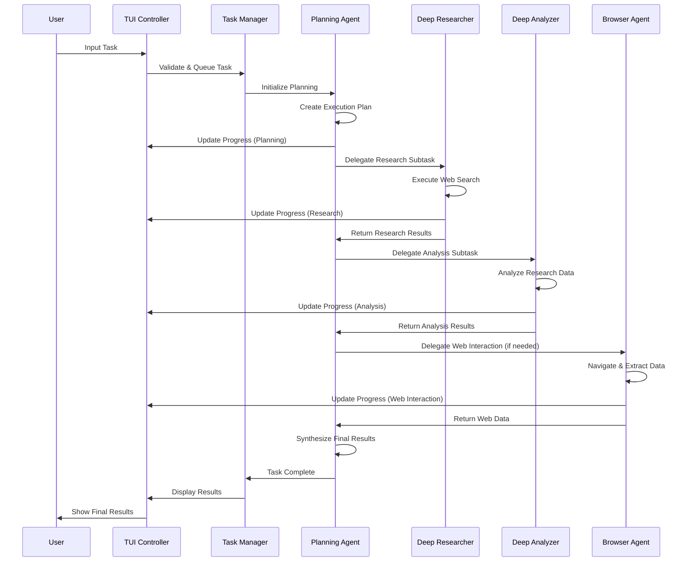
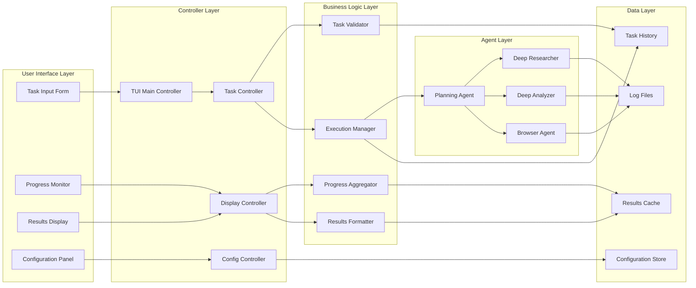
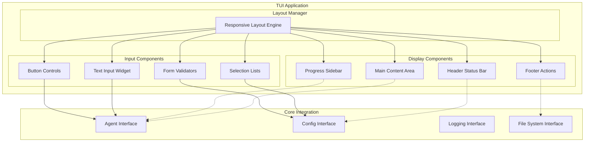

# TUI System Architecture Diagrams

## Overall TUI Architecture

```mermaid
graph TD
    A[TUI Main Application] --> B[Input Manager]
    A --> C[Display Manager]
    A --> D[Task Execution Manager]
    A --> E[Configuration Manager]

    B --> B1[Task Input Handler]
    B --> B2[Keyboard/Mouse Events]
    B --> B3[Form Validation]

    C --> C1[Main Dashboard]
    C --> C2[Progress Display]
    C --> C3[Results Viewer]
    C --> C4[Status Monitor]

    D --> D1[Agent Coordinator]
    D --> D2[Execution Monitor]
    D --> D3[Progress Tracker]
    D --> D4[Error Handler]

    E --> E1[Model Configuration]
    E --> E2[User Preferences]
    E --> E3[Agent Settings]
    E --> E4[Export Settings]

    D1 --> F[DeepResearchAgent Core]
    F --> F1[Planning Agent]
    F --> F2[Deep Researcher]
    F --> F3[Deep Analyzer]
    F --> F4[Browser Agent]
```

## User Flow State Machine

```mermaid
stateDiagram-v2
    [*] --> Welcome
    Welcome --> MainMenu
    MainMenu --> TaskInput : New Task
    MainMenu --> TaskHistory : View History
    MainMenu --> Settings : Configure
    MainMenu --> [*] : Exit

    TaskInput --> TaskValidation
    TaskValidation --> TaskInput : Invalid
    TaskValidation --> TaskExecution : Valid

    TaskExecution --> ExecutionMonitoring
    ExecutionMonitoring --> ExecutionMonitoring : In Progress
    ExecutionMonitoring --> ResultsDisplay : Completed
    ExecutionMonitoring --> ErrorHandling : Failed
    ExecutionMonitoring --> TaskCancelled : User Cancel

    ResultsDisplay --> ResultsActions
    ResultsActions --> MainMenu : Continue
    ResultsActions --> TaskInput : New Task
    ResultsActions --> Export : Save Results

    ErrorHandling --> MainMenu : Retry
    TaskCancelled --> MainMenu : Return
    Export --> ResultsDisplay : Done

    TaskHistory --> TaskDetail : Select Task
    TaskDetail --> TaskRerun : Rerun
    TaskDetail --> TaskHistory : Back
    TaskRerun --> TaskExecution

    Settings --> ConfigModel : Model Settings
    Settings --> ConfigAgent : Agent Settings
    Settings --> ConfigUI : UI Preferences
    ConfigModel --> Settings : Save
    ConfigAgent --> Settings : Save
    ConfigUI --> Settings : Save
    Settings --> MainMenu : Done
```

## Agent Execution Flow

```mermaid
sequenceDiagram
    participant U as User
    participant TUI as TUI Controller
    participant TM as Task Manager
    participant PA as Planning Agent
    participant DR as Deep Researcher
    participant DA as Deep Analyzer
    participant BA as Browser Agent

    U->>TUI: Input Task
    TUI->>TM: Validate & Queue Task
    TM->>PA: Initialize Planning

    PA->>PA: Create Execution Plan
    PA->>TUI: Update Progress (Planning)

    PA->>DR: Delegate Research Subtask
    DR->>DR: Execute Web Search
    DR->>TUI: Update Progress (Research)
    DR->>PA: Return Research Results

    PA->>DA: Delegate Analysis Subtask
    DA->>DA: Analyze Research Data
    DA->>TUI: Update Progress (Analysis)
    DA->>PA: Return Analysis Results

    PA->>BA: Delegate Web Interaction (if needed)
    BA->>BA: Navigate & Extract Data
    BA->>TUI: Update Progress (Web Interaction)
    BA->>PA: Return Web Data

    PA->>PA: Synthesize Final Results
    PA->>TM: Task Complete
    TM->>TUI: Display Results
    TUI->>U: Show Final Results
```

## Data Flow Architecture

```mermaid
flowchart LR
    subgraph "User Interface Layer"
        UI1[Task Input Form]
        UI2[Progress Monitor]
        UI3[Results Display]
        UI4[Configuration Panel]
    end

    subgraph "Controller Layer"
        C1[TUI Main Controller]
        C2[Task Controller]
        C3[Display Controller]
        C4[Config Controller]
    end

    subgraph "Business Logic Layer"
        BL1[Task Validator]
        BL2[Execution Manager]
        BL3[Progress Aggregator]
        BL4[Results Formatter]
    end

    subgraph "Agent Layer"
        AL1[Planning Agent]
        AL2[Deep Researcher]
        AL3[Deep Analyzer]
        AL4[Browser Agent]
    end

    subgraph "Data Layer"
        D1[Task History]
        D2[Configuration Store]
        D3[Results Cache]
        D4[Log Files]
    end

    UI1 --> C1
    UI2 --> C3
    UI3 --> C3
    UI4 --> C4

    C1 --> C2
    C2 --> BL1
    C2 --> BL2
    C3 --> BL3
    C3 --> BL4

    BL2 --> AL1
    AL1 --> AL2
    AL1 --> AL3
    AL1 --> AL4

    BL1 --> D1
    BL2 --> D1
    BL3 --> D3
    BL4 --> D3
    C4 --> D2

    AL2 --> D4
    AL3 --> D4
    AL4 --> D4
```

## Component Interaction Model

```mermaid
graph TB
    subgraph "TUI Application"
        subgraph "Display Components"
            DC1[Header Status Bar]
            DC2[Main Content Area]
            DC3[Progress Sidebar]
            DC4[Footer Actions]
        end

        subgraph "Input Components"
            IC1[Text Input Widget]
            IC2[Selection Lists]
            IC3[Button Controls]
            IC4[Form Validators]
        end

        subgraph "Layout Manager"
            LM[Responsive Layout Engine]
        end
    end

    subgraph "Core Integration"
        CI1[Agent Interface]
        CI2[Config Interface]
        CI3[Logging Interface]
        CI4[File System Interface]
    end

    DC1 -.-> CI2
    DC2 -.-> CI1
    DC3 -.-> CI1
    DC4 -.-> CI4

    IC1 --> CI1
    IC2 --> CI2
    IC3 --> CI1
    IC4 --> CI2

    LM --> DC1
    LM --> DC2
    LM --> DC3
    LM --> DC4
    LM --> IC1
    LM --> IC2
    LM --> IC3
    LM --> IC4
```